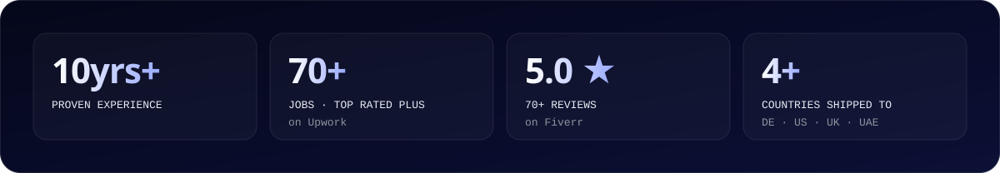
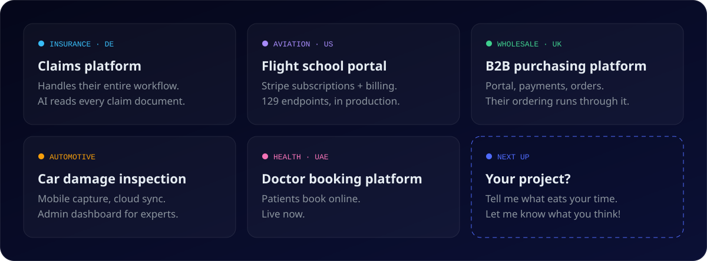
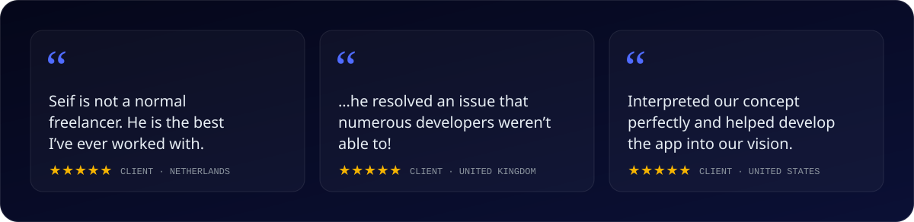
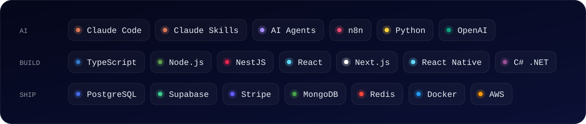

<!-- Wanna change the banner, numbers, cards, quotes, stack or buttons? Edit scripts/config.mjs then run: node scripts/build.mjs -->

<picture>
  <source media="(max-width: 600px)" srcset="https://raw.githubusercontent.com/seifsg/seifsg/main/assets/stats-mobile.svg">
  
</picture>

Hey there - I made my client an automation so GOOD that he actually fired me 😅

I basically replaced my whole position with an AI? He is still using it to this day as we speak and he says it is still delivering and getting better with each model.

Now he just uses his phone to get work done?

The recipe is called **AI Software Factory**. Basically what we developers call Software development life cycle got compressed into a couple of Claude Skills. And with the use of the right tools. Connecting it all together. With some CI CD magic.

Oh, who am I? I'm just a software engineer with 10yrs+ of proven experience. I build the systems that run a business. And the AI automation that sits on top. Founder of [HorizonLux](https://www.horizonlux.com).

 
▶ Hi! I'm Seif ( my intro video )

### 🧱 Some stuff I built

I wouldn't blame you if you don't believe me, why would you trust a stranger? So here's some of it:

<picture>
  <source media="(max-width: 600px)" srcset="https://raw.githubusercontent.com/seifsg/seifsg/main/assets/work-mobile.svg">
  
</picture>

Most of my work was direct with companies, some of it still live. Here's what a few clients said on [Fiverr](https://www.fiverr.com/seifsgayer), more reviews on [Upwork](https://www.upwork.com/freelancers/~013be65b25efd85cea) too:

<picture>
  <source media="(max-width: 600px)" srcset="https://raw.githubusercontent.com/seifsg/seifsg/main/assets/quotes-mobile.svg">
  
</picture>

Background, if you're into that: I've been Director of Software Development at Locus Digital and Product Software Developer at Linedata. B.S. in Computer Science.

### ⚡ Btw, I also help people with the following:

* **Custom development**. Build PoCs, MVPs, End to End full product launch.
* **Team augmentation** ( Ship-Fast Engineers ). No commitment, 10hrs, 20hrs or full time. Cancel anytime.
* **AI integrations**, n8n automations, AI Agents, tools setup. Consultations.

### 🧭 How I work

For builds, I write the spec first. Fixed scope, dated milestones, documented handover. Then I build, deploy and support.

🗣️ Arabic ( native ), English ( fluent ), French and a bit of Italian. 
🕐 Tunisia, UTC+1. All day with Europe, mornings with the US East coast.

<picture>
  <source media="(max-width: 600px)" srcset="https://raw.githubusercontent.com/seifsg/seifsg/main/assets/stack-mobile.svg">
  
</picture>

🤔 Got something in your business that is very time consuming or manual work?

I'd be more than happy to take a look. Worst case for you, you get a free second opinion. Sounds fair enough?

Let me know what you think!

Cheers, 
Seif

<picture>
  <source media="(prefers-color-scheme: dark)" srcset="https://raw.githubusercontent.com/seifsg/seifsg/output/snake-dark.svg">
  
</picture>

P.S. Wondering why my public repos look like a 2014 museum? Client work stays private 😅 Cooking right now: a free community version of the AI Software Factory and an AI course. Follow so you don't miss them when they're out !!
